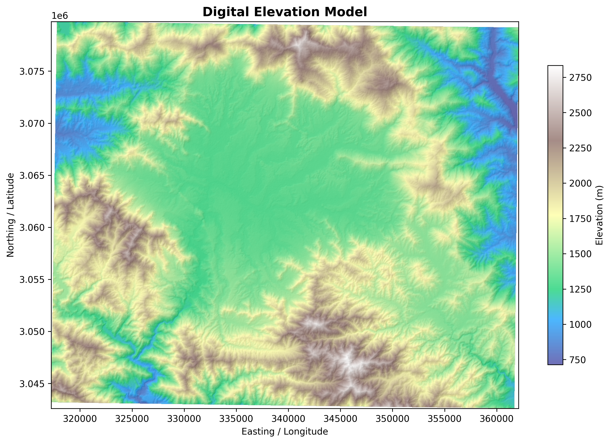
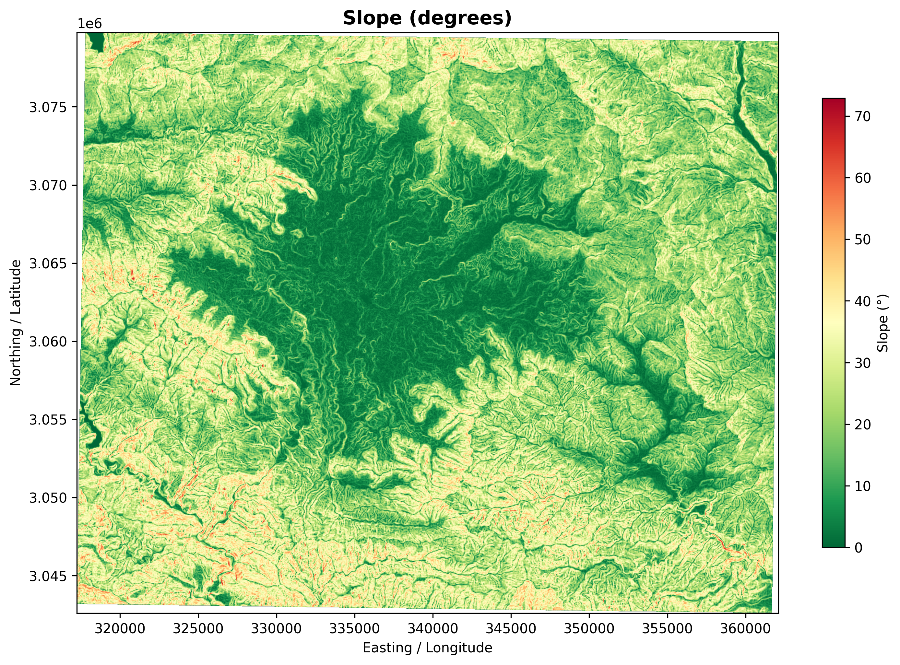
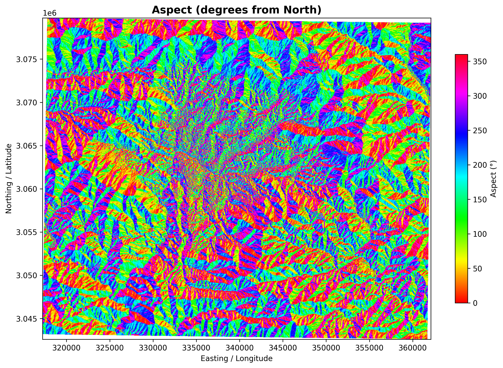
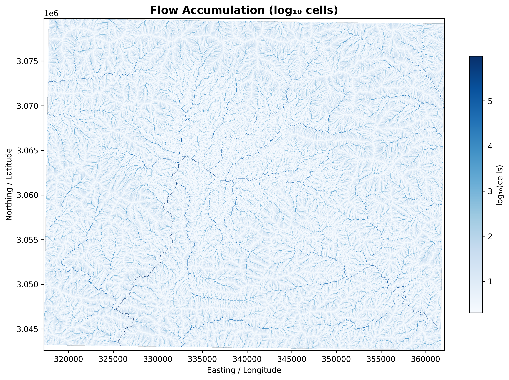
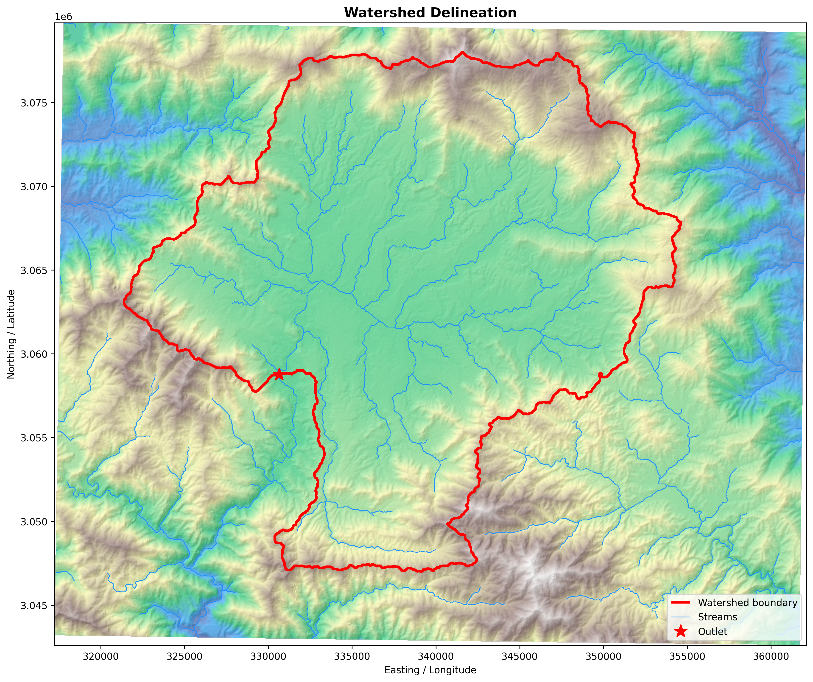
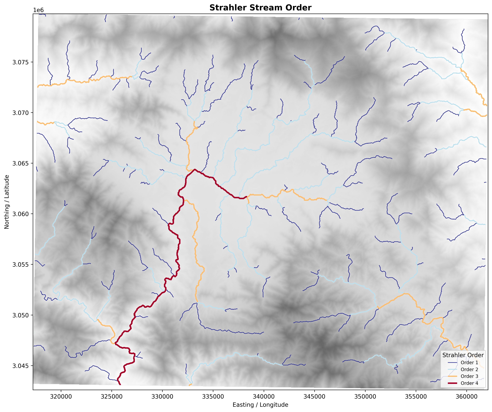
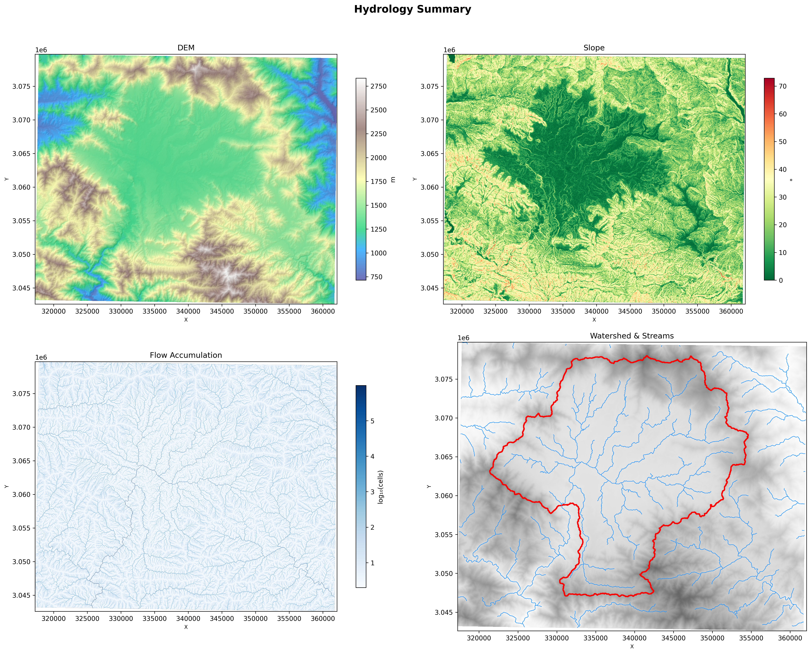

# Hydrological Application

A comprehensive Python-based hydrological modeling and analysis toolkit designed for watershed delineation, flow analysis, and hydrological characterization. Built with cross-platform compatibility and path independence for seamless execution across different systems.

## 🌊 Project Overview

This project provides a modular framework for hydrological analysis, starting with **watershed delineation** and expanding to include additional hydrology modules. The toolkit leverages open-source geospatial libraries and WhiteboxTools for sophisticated terrain analysis and watershed characterization.

## 📦 Current Modules

### 1. Watershed Delineation (`Modules/01_Watershed_delineation/`)

A complete workflow for downloading Digital Elevation Models (DEM), processing terrain data, and delineating watersheds with multiple outlet support.

**Key Features:**
- 🛰️ **DEM Download**: Automatic download from multiple sources (SRTM, NASADEM, FABDEM, MERIT, ALOS, COPERNICUS)
- 🗻 **Terrain Analysis**: DEM conditioning, breach filling, projection handling
- 💧 **Flow Analysis**: Flow direction, flow accumulation, stream network extraction
- 🏔️ **Terrain Characterization**: Slope, aspect, curvature, and topographic indices
- 🎯 **Watershed Delineation**: Single and multiple outlet watershed delineation
- 📊 **Stream Ordering**: Strahler order computation for stream classification
- 📈 **Visualization**: Comprehensive figures for all analysis layers

## 🎨 Output Examples

### Digital Elevation Model (DEM)


### Slope Analysis


### Aspect (Slope Direction)


### Flow Accumulation


### Delineated Watershed


### Stream Network with Strahler Ordering


### Comprehensive Analysis Summary


## 📋 Installation

### Prerequisites

- Python 3.8 or higher
- GDAL/OGR libraries
- WhiteboxTools

### Step 1: Clone the Repository

```bash
git clone https://github.com/hanikhydro/Hydrological_application.git
cd Hydrological_application
```

### Step 2: Create Virtual Environment

```bash
# Windows
python -m venv venv
venv\Scripts\activate

# Linux/macOS
python3 -m venv venv
source venv/bin/activate
```

### Step 3: Install Dependencies

```bash
pip install -r requirements.txt
```

**Key Dependencies:**
- `whitebox`: Terrain analysis and hydrological modeling
- `rasterio`: Raster geospatial data handling
- `geopandas`: Vector geospatial data handling
- `numpy`, `scipy`: Numerical computing
- `matplotlib`: Visualization
- `requests`: HTTP requests for DEM downloads

## 🚀 Quick Start

### Basic Watershed Delineation

```python
from Modules.Watershed_delineation.hydrology_tool import run_hydrology_workflow
from Modules.Watershed_delineation.dem_downloader import build_config, download_dem

# Configure DEM download
cfg = build_config(
    west=85.15,
    south=27.5,
    east=85.6,
    north=27.83,
    dem_source="SRTM",
    opentopo_key="your_opentopo_api_key",
)

# Download DEM
dem = download_dem(cfg)

# Run complete hydrology workflow
results = run_hydrology_workflow(
    dem_path="path/to/dem.tif",
    outlet_coords=(85.29356864039967, 27.658033127349174),
    output_dir="outputs/"
)
```

### Multiple Outlet Delineation

```python
# Define multiple outlet coordinates
outlets = [
    (85.29356864039967, 27.658033127349174),  # Outlet 1
    (85.36315667973906, 27.669570166448718),  # Outlet 2
    (85.36157906231159, 27.667862066149464),  # Outlet 3
]

results = run_hydrology_workflow(
    dem_path="path/to/dem.tif",
    outlet_coords=outlets,
    output_dir="outputs/"
)
```

## 📁 Project Structure

```
Hydrological_application/
├── Modules/
│   ├── 01_Watershed_delineation/
│   │   ├── dem_downloader.py          # DEM download and configuration
│   │   ├── watershed_delineation.py   # Main workflow orchestration
│   │   ├── hydrology_tool.py          # Hydrological analysis engine
│   │   └── outputs/
│   │       ├── dem/                   # Downloaded DEM files
│   │       ├── figures/               # Visualization outputs
│   │       ├── hydrology/             # Hydrological analysis outputs
│   │       ├── streams/               # Stream network shapefiles/GeoJSON
│   │       ├── watershed/             # Watershed delineation outputs
│   │       └── logs/                  # Processing logs
│   └── [Future modules will go here]
├── outputs/                            # Project-wide outputs
├── README.md
├── requirements.txt
└── LICENSE
```

## 🔧 Configuration

### DEM Download Sources

The toolkit supports multiple DEM sources:

| Source | Resolution | Coverage | API Key Required |
|--------|-----------|----------|------------------|
| SRTM | 30m | Global (60°N - 57°S) | No |
| NASADEM | 30m | Global | No |
| FABDEM | 30m | Global | No |
| MERIT | 90m | Global | No |
| ALOS | 30m | Global | No |
| COPERNICUS | 30m | Global | No |

**Note:** Some sources require an OpenTopography API key, available at [OpenTopography](https://cloud.sdsc.edu/v1/AUTH_opentopography/Raster/SRTM_GL30/SRTM_GL30_Ellip/SRTM_GL30_Ellip_srtm.json)

## 📊 Output Files

### Raster Outputs
- **DEM**: Preprocessed Digital Elevation Model
- **Flow Direction**: Direction of water flow from each cell
- **Flow Accumulation**: Cumulative water flow to each cell
- **Slope**: Terrain slope in degrees
- **Aspect**: Slope direction (N, NE, E, etc.)
- **Curvature**: Profile and planform curvature
- **Strahler Order**: Stream ordering classification

### Vector Outputs
- **Watersheds**: Delineated watershed boundaries (Shapefile & GeoJSON)
- **Streams**: Stream network with attributes
- **Outlets**: Snapped outlet point locations

### Visualization
- High-resolution PNG figures for all analysis layers
- Summary visualization combining multiple layers

## 🔄 Portability

This application is designed for **cross-platform, cross-computer execution** without manual path modifications:

- ✅ Uses relative paths computed from script location
- ✅ Automatic output directory creation
- ✅ Dynamic module discovery
- ✅ Works on Windows, Linux, and macOS
- ✅ No hardcoded drive letters or absolute paths

## 🚧 Future Modules (Planned)

The following hydrology modules are planned for integration:

- **Hydrological Routing**: Channel routing and flow propagation
- **Rainfall-Runoff Modeling**: HEC-HMS or TOPMODEL integration
- **Groundwater Analysis**: MODFLOW coupling
- **Water Quality Modeling**: QUAL2K or WASP integration
- **Climate Data Processing**: CMIP5/CMIP6 data handling
- **Flood Hazard Assessment**: Inundation mapping and risk analysis
- **Hydrogeomorphology**: Channel morphodynamics and erosion modeling

## 📚 Dependencies & References

### Key Libraries
- **WhiteboxTools**: Geospatial analysis and hydrological modeling
- **GDAL**: Geospatial data abstraction library
- **Rasterio**: Python interface for geospatial raster data
- **GeoPandas**: Geospatial vector data manipulation
- **Shapely**: Geometric operations

### Data Sources
- **SRTM DEM**: NASA Shuttle Radar Topography Mission
- **OpenTopography**: Open access geospatial data repository

## 🐛 Troubleshooting

### Issue: "Module not found" errors
**Solution**: Ensure you're running from the correct directory and the virtual environment is activated.

### Issue: GDAL installation problems
**Solution**: On Windows, use `conda install gdal` instead of pip for easier installation.

### Issue: WhiteboxTools permission denied
**Solution**: Ensure WhiteboxTools has execute permissions and the output directory is writable.

### Issue: DEM download fails
**Solution**: 
- Check your internet connection
- Verify your OpenTopography API key
- Try a different DEM source
- Check if the bounding box is within the DEM coverage area

## 📖 Example: Complete Analysis Workflow

```python
#!/usr/bin/env python3
"""Complete watershed analysis example"""

from pathlib import Path
import sys

# Setup paths
SCRIPT_DIR = Path(__file__).parent
sys.path.insert(0, str(SCRIPT_DIR / "Modules" / "01_Watershed_delineation"))

from hydrology_tool import run_hydrology_workflow
from dem_downloader import build_config, download_dem

# Define study area (Nepal/Kathmandu Valley region)
config = build_config(
    west=85.15,
    south=27.5,
    east=85.6,
    north=27.83,
    dem_source="SRTM",
    opentopo_key="your_key_here"
)

# Download DEM
print("Downloading DEM...")
dem = download_dem(config)

# Run analysis
print("Running hydrological analysis...")
results = run_hydrology_workflow(
    dem_path=str(config["work_dir"] / "SRTM_DEM.tif"),
    outlet_coords=(85.29356864039967, 27.658033127349174),
    output_dir=str(Path.cwd() / "outputs")
)

print("Analysis complete!")
print(f"Watershed area: {results['watershed_area']} km²")
print(f"Total stream length: {results['stream_length']} km")
```

## 📝 License

This project is open source. See LICENSE file for details.

## 👤 Author

**Hanik Lakhe**
- GitHub: [@hanikhydro](https://github.com/hanikhydro)
- Email: hlakhe123.hl@gmail.com

## 🤝 Contributing

Contributions are welcome! Please feel free to:
1. Fork the repository
2. Create a feature branch
3. Commit your changes
4. Push to the branch
5. Create a Pull Request

## 📬 Contact & Support

For issues, questions, or suggestions:
- Open an issue on GitHub
- Contact the author directly

## 🙏 Acknowledgments

- **WhiteboxTools**: Dr. John Lindsay and team for the powerful geospatial analysis library
- **NASA**: For SRTM DEM data
- **OpenTopography**: For DEM data hosting and distribution
- **GDAL/QGIS Community**: For geospatial libraries and tools

---

**Last Updated:** October 2026  
**Status:** Active Development
